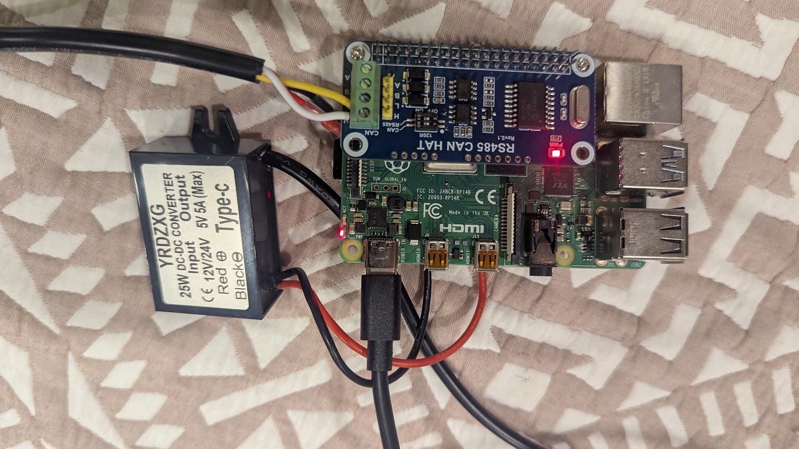

# rv-control

`rv-control` collects telemetry from an RV-C CAN bus, Renogy BLE devices, Hughes Power Watchdog devices, WLED controllers, gpsd, and ELM327 Bluetooth OBD-II adapters, publishing each reading as JSON to Mosquitto.

The runtime is self-contained and does not import code or configuration from external checkout directories:

- `src/rv_control/data/rvc-spec.yml` is the project-owned RV-C DGN specification.
- `src/rv_control/renogybt` contains the project-owned Renogy client implementation.
- `src/rv_control/hughes.py` contains the standalone Hughes BLE implementation.
- `src/rv_control/wled.py` contains the WLED local JSON API source.
- `src/rv_control/gpsd.py` contains the gpsd JSON TCP source.
- `src/rv_control/obd.py` contains the read-only ELM327 Bluetooth OBD-II PID source.

## User guide

## Install

```sh
python3 -m venv .venv
. .venv/bin/activate
pip install -r requirements.txt
pip install -e .
```

The editable install provides both `rv-control` and `rvcontrol` commands. The equivalent module form is `python -m rv_control`.

## Commands

Copy the anonymized example configuration to create your local configuration:

```sh
cp config-example.ini config.ini
$EDITOR config.ini
```

Show the available global options and commands:

```sh
rv-control --help
rv-control check --help
rv-control comms-check --help
rv-control interrogate --help
rv-control coach-list --help
rv-control coach-exec --help
rv-control run --help
```

Validate the configuration without opening CAN, Bluetooth, or MQTT connections:

```sh
rv-control --config config.ini check
```

The check command prints the resolved config path and whether each source is enabled. With the supplied example configuration, the expected output is similar to:

```text
Configuration OK: /path/to/config.ini
rv_c_bus: rvc
renogy_controller: renogy
hughes_power_watchdog: hughes
```

Check communications for every configured source without starting the service:

```sh
rv-control --config config.ini comms-check
```

Enabled RV-C checks open and close the configured SocketCAN interface and verify the DGN spec file. Enabled Bluetooth checks contact the local Bluetooth stack, scan for the configured device address, and verify its advertised name when configured. The command exits with status `1` if an enabled source fails.

Renogy's communication check also lists the register blocks exposed by the configured client type, including read/write access, register address, word count, and the decoded attribute or operation name. Hughes checks list the telemetry attributes exposed by the detected device generation.

Interrogate every enabled source to perform live reads and print all returned attributes as formatted JSON:

```sh
rv-control --config config.ini interrogate
```

Renogy interrogation connects once, reads every register block defined by the configured Renogy client type, and prints the decoded state. Hughes connects once, waits for a complete notification packet, and prints its decoded power attributes. RV-C listens for `interrogate_seconds` (10 by default), decodes received DGN frames, and prints the latest state for each DGN/source combination. The command exits with status `1` if an enabled source cannot be interrogated.

List available coach semantic commands and command groups:

```sh
rv-control --config config.ini coach-list
```

Execute a coach semantic command or command group action:

```sh
rv-control --config config.ini coach-exec livingroom_lights toggle
rv-control --config config.ini coach-exec evening_scene activate
```

Run the collectors in the foreground:

```sh
rv-control --config config.ini run
```

Enable diagnostic logging while troubleshooting hardware or MQTT connections:

```sh
rv-control --verbose --config config.ini run
```

Stop a foreground process with `Ctrl+C`. The process stops source threads, disconnects MQTT, and exits cleanly.

## Bluetooth discovery

Use the lightweight discovery tool to find nearby devices that advertise names associated with Renogy or Hughes Power Watchdog hardware:

```sh
.venv/bin/python tools/bt_discovery.py
```

Choose a different adapter or scan duration when needed:

```sh
.venv/bin/python tools/bt_discovery.py --adapter hci0 --timeout 15
```

The tool prints each matching device's family, Bluetooth address, advertised name, and signal strength. It does not connect to or modify any device. It scans BLE only; ELM327 OBD-II adapters use Bluetooth Classic and are discovered and paired with `bluetoothctl` as described in [ELM327 OBD-II adapter (Bluetooth Classic)](#elm327-obd-ii-adapter-bluetooth-classic).

## Targets

Telemetry goes to the sections listed in `[target] enabled-targets`; each section has a `type` (`mqtt` or `store`), like sources. `store` writes the latest payload per topic to a local JSON file (`directory`/`filename`, default `data/state.json`), keyed by the same full topic MQTT uses, e.g. `rv/renogy`; its `base_topic` defaults to the MQTT target's. Without a `[target]` section, the legacy `[service] targets` list (default `mqtt`) applies. New targets subclass `rv_control.target.Target`.

## MQTT check

Use the MQTT check tool to verify the broker connection and observe project topics:

```sh
.venv/bin/python tools/mqtt_check.py
```

Choose a different broker, credentials, topic prefix, or wait time when needed:

```sh
.venv/bin/python tools/mqtt_check.py \
	--host localhost --port 1883 --base-topic rv --timeout 5
```

Retrieve all retained or live values received for one exact MQTT topic:

```sh
.venv/bin/python tools/mqtt_check.py --topic rv/renogy/status --timeout 5
```

Without `--topic`, the tool subscribes to `<base-topic>/#` and prints retained or live topics received during the check. With `--topic`, it subscribes to that exact topic and prints every value received. Values delivered as retained MQTT messages are marked `[retained]`, distinguishing them from live publications received during the check. MQTT does not provide a portable command to list empty topics, so a topic with no retained message and no activity during the timeout cannot be reported by this tool.

## UI configuration API

Use the UI API helper to inspect or configure the `rv-control-ui` device over its local HTTP API. Its default host is `192.168.8.72`; every subcommand also accepts `--host` for another device address.

```sh
.venv/bin/python tools/ui_api.py info
.venv/bin/python tools/ui_api.py get-config -o config.json
.venv/bin/python tools/ui_api.py set-config --host 192.168.8.72 -i config.json
.venv/bin/python tools/ui_api.py restart
```

`get-config` writes the device's complete configuration to `config.json` by default; use `-o` to select another local destination. This file includes Wi-Fi and MQTT credentials, so keep it private and do not commit it. `set-config` requires `-i` to name the complete local JSON file to upload. The UI validates the file, stores it, and restarts when the upload succeeds. `info` and `get-config` are read-only; `set-config` and `restart` change the running device.

## Configuration

Edit only the sections for hardware installed in the RV. List enabled source sections in `[source]`; each listed section selects its implementation with `type`.

```ini
[mqtt]
host = localhost
port = 1883
base_topic = rv
username =
password =
write_enabled = false

[source]
enabled-sources = renogy_controller

[rv_c_bus]
type = rvc
interface = can0
specfile = src/rv_control/data/rvc-spec.yml
parameterized_strings = true
write_enabled = false

[renogy_controller]
type = renogy
device-type = RNG_CTRL
adapter = hci0
mac_addr = AA:BB:CC:DD:EE:FF
alias = BT-TH-EXAMPLE
device_id = 255
max_retry = 3
reconnect_delay =
max_reconnect_delay =
discovery_timeout = 5
reconnect_jitter = 0.1
persistent_connection =
enable_polling = true
poll_interval = 60
read_timeout = 15
request_interval = 0.5
write_settle_delay = 0.5
temperature_unit = F
fields =
topic = renogy
write_enabled = false
```

The Renogy section is self-contained. `device-type` can be `RNG_CTRL`, `RNG_CTRL_HIST`, `RNG_BATT`, `RNG_INVT`, `RNG_INVT_HF`, `RNG_DCC`, or `RNG_SHNT`. Use the Bluetooth adapter's address format exactly as reported by discovery tools. An empty `persistent_connection` inherits `[service] daemon_mode`; it defaults to enabled for daemon operation. Each connection attempt performs fresh discovery and creates a fresh BLE client. Persistent mode also keeps polling active, so use `enable_polling = true` for continuous daemon telemetry.

```ini
[hughes_power_watchdog]
type = hughes
adapter = hci0
address = AA:BB:CC:DD:EE:FF
name = PMD-EXAMPLE
circuit_amps = 30
max_retry =
reconnect_delay =
max_reconnect_delay =
notification_timeout = 60
connect_settle_delay = 2
persistent_connection =
topic = hughes
write_enabled = false
```

Set `circuit_amps = 50` for a split-phase Power Watchdog. The source then waits for both legacy line notifications and publishes them together using `voltage_line_1`, `current_line_1`, `power_line_1`, `energy_line_1`, and their `_line_2` counterparts. Leave this at `30` for a single-leg unit, which publishes each measurement immediately.

gpsd connects to its JSON TCP stream, enables JSON reports with the gpsd `WATCH` request, and publishes each received JSON object unchanged:

```ini
[gpsd]
type = gpsd
host = localhost
port = 2947
timeout = 5
topic = gpsd
```

Add the gpsd section name to `[source]` `enabled-sources` to start it. gpsd reports are published beneath the configured MQTT base topic, for example `rv/gpsd`.

WLED controllers use a named source section with a local JSON API base URL:

```ini
[wled_patio]
type = wled
base_url = http://wled.local
timeout = 5
poll_interval = 60
topic = wled/patio
write_enabled = false
```

Coach specifications are configured in the `[coach]` section:

```ini
[coach]
specfile = src/rv_control/coaches/thor-magnitude-bh35-2020.yml
```

Coach command mappings reference source sections (such as `config_section: wled_patio` or `config_section: rv_c_bus`); they do not contain device hosts, CAN interfaces, or credentials.

WLED `comms-check` requests `/json/info`, `interrogate` requests `/json/state`, and daemon mode polls `/json/state` at `poll_interval` seconds. State snapshots are published to the configured `topic`. WLED commands received on `<base_topic>/<source-section>/set` are sent to `/json/state` only when both global MQTT `write_enabled = true` and the WLED section's `write_enabled = true` are set.

Use the standalone WLED tool for direct local control. It reads the same INI section used by the source:

```sh
PYTHONPATH=src .venv/bin/python tools/wled_tool.py \
	--config config.ini --section wled_patio status
PYTHONPATH=src .venv/bin/python tools/wled_tool.py \
	--config config.ini --section wled_patio info
```

Basic controls are available with `on`, `off`, and brightness values from `0` through `255`:

```sh
PYTHONPATH=src .venv/bin/python tools/wled_tool.py \
	--config config.ini --section wled_patio on
PYTHONPATH=src .venv/bin/python tools/wled_tool.py \
	--config config.ini --section wled_patio off
PYTHONPATH=src .venv/bin/python tools/wled_tool.py \
	--config config.ini --section wled_patio brightness 128
```

For advanced WLED state fields, send a JSON object with `state`:

```sh
PYTHONPATH=src .venv/bin/python tools/wled_tool.py \
	--config config.ini --section wled_patio state \
	'{"on":true,"bri":128,"seg":[{"col":[[255,80,20]]}]}'
```

Direct write commands require `write_enabled = true` in the selected WLED section. The tool does not embed controller addresses; `base_url`, timeout, and other connection details remain in `config.ini`.

ELM327 Bluetooth OBD-II adapters use a named source section. The source connects with a raw Bluetooth RFCOMM socket (no `rfcomm bind`, no serial device node), so pair and trust the adapter once with `bluetoothctl` before first use (see [ELM327 OBD-II adapter (Bluetooth Classic)](#elm327-obd-ii-adapter-bluetooth-classic) for discovery, pairing, and controller selection). `adapter` selects the local controller by `hciN` name or controller MAC address, and the RFCOMM socket is bound to it:

```ini
[obd_engine]
type = obd
adapter = hci0
address = 00:1D:A5:XX:XX:XX
channel = 1
header = 7E0
protocol = 0
fallback_protocol = 6
poll_hz = 2
connect_timeout = 10
read_timeout = 5
max_failed_cycles = 3
reconnect_delay = 2
max_reconnect_delay = 60
max_retry =
topic = obd
pid.egt11 = 22, F478, ((b0*256+b1)*0.18)-40, °F
pid.rpm = 01, 0C, (b0*256+b1)/4, RPM
pid.coolant_temp = 01, 05, (b0-40)*1.8+32, °F
```

Each `pid.<name> = mode, pid, decode, unit` entry defines one PID. `mode` and `pid` are hexadecimal; only read-only OBD modes (01, 02, 03, 05, 06, 07, 09, 0A, 21, 22) are accepted. `decode` is an arithmetic expression over the response data bytes `b0`, `b1`, … (after the echoed mode and PID); it may use numeric constants, arithmetic, bitwise and comparison operators, conditional expressions, and `abs`, `min`, `max`, `round`, `int`, and `float`. Expressions are validated and compiled once at startup. INI option names are case-insensitive, so use snake_case PID names; they become the payload keys. Write a literal `%` (modulo) as `%%`.

On connect the source sends `ATZ`, `ATE0`, `ATL0`, `ATS0`, `ATH0`, `ATSP<protocol>`, and `ATSH<header>` (when `header` is set), reads the adapter voltage, and probes the ECU with `0100`. If the probe fails and `fallback_protocol` is set, it retries with that protocol (for example `6` for 11-bit 500 kbps CAN). PIDs are then queried sequentially once per cycle at `poll_hz`; a PID returning `NO DATA`, an error, or a short response is published as `null` and polling continues.

Each cycle publishes one flat snapshot such as `{"egt11": 140.0, "rpm": 850.0, "coolant_temp": null, "timestamp": "..."}` to `<base_topic>/<topic>`. Availability changes publish `{"online": ..., "adapter": ..., "voltage": ..., "protocol": ..., "message": ...}` to `<base_topic>/<topic>/status`. When the source goes from online to offline it also publishes one snapshot with every PID set to `null`, so displays that only subscribe to `<base_topic>/<topic>` (such as rv-control-ui, which shows `null` as `--`) do not keep showing the last engine values. The source treats both an unreachable adapter and a reachable adapter with a silent ECU (ignition off, or `max_failed_cycles` consecutive cycles with no PID answering) as offline: it closes the socket and reconnects with exponential backoff from `reconnect_delay` to `max_reconnect_delay`. Offline/online transitions are logged once rather than on every retry. `max_retry` blank inherits `[service]`; `0` retries forever. `comms-check` passes when the adapter answers, reports whether the ECU responded, and lists configured PIDs with units.

Use the standalone OBD tool to work with the adapter directly. It reads the same INI section and is read-only:

```sh
PYTHONPATH=src .venv/bin/python tools/obd_tool.py --config config.ini --section obd_engine info
PYTHONPATH=src .venv/bin/python tools/obd_tool.py --section obd_engine supported
PYTHONPATH=src .venv/bin/python tools/obd_tool.py --section obd_engine read
PYTHONPATH=src .venv/bin/python tools/obd_tool.py --section obd_engine monitor --hz 1 --count 10
PYTHONPATH=src .venv/bin/python tools/obd_tool.py --section obd_engine query 22F478
```

Stop the `rvcontrol run` service before using the tool; an ELM327 accepts only one RFCOMM connection at a time.

Hughes uses the same `persistent_connection` setting as Renogy. Runtime connects directly to the configured address without repeatedly scanning; when persistence is enabled, a dropped session reconnects to that address after `service.reconnect_delay` seconds. `comms-check` remains a one-shot scan and ignores daemon mode.

Daemon retry behavior is configured in the service section:

```ini
[service]
daemon_mode = true
reconnect_delay = 10
max_retry = 0
max_reconnect_delay = 300
```

`max_retry = 0` means unlimited retries. `reconnect_delay`, `max_reconnect_delay`, and `max_retry` may be overridden in an individual Renogy, Hughes, or OBD section; blank source values inherit `[service]`. `max_reconnect_delay` caps exponential backoff. Renogy supports `discovery_timeout`, `read_timeout`, `request_interval`, `write_settle_delay`, and `reconnect_jitter` per source. `request_interval` spaces register reads, `write_settle_delay` gives the device time to receive a request, and `reconnect_jitter` prevents simultaneous adapter retries. Hughes uses `notification_timeout` to reconnect a session that remains connected but stops delivering telemetry, and `connect_settle_delay` (default 2 seconds) to pause after connecting before subscribing. Hughes connection setup shares the per-adapter lock with Renogy, and a session that delivered telemetry before stalling restarts backoff from `reconnect_delay`. Source supervision restarts a collector thread that exits unexpectedly.

The MQTT `write_enabled` option is a global safety switch. RV-C, Renogy, and WLED also require their own source-level `write_enabled = true` before accepting commands. Hughes and OBD are telemetry-only.

Bluetooth access usually requires membership in the `bluetooth` group or appropriate Linux capabilities. RV-C requires a configured SocketCAN `can0` interface and the MCP2515 kernel overlay.

Topics are `<base_topic>/<source>` for source snapshots. RV-C additionally publishes each decoded DGN at `<base_topic>/rvc/<dgn-name>`.

## MQTT commands

Bidirectional commands are opt-in. Set `mqtt.write_enabled = true` and the relevant source's `write_enabled = true`, then publish JSON to the source command topic.

Send an extended RV-C CAN frame:

```sh
mosquitto_pub -h localhost -t rv/rv_c_bus/set \
	-m '{"can_id":"0x19FEDB99","data":"02FFC803FF00FFFF"}'
```

Send a raw Renogy BLE request:

```sh
mosquitto_pub -h localhost -t rv/renogy_controller/set \
	-m '{"bytes":"FF0301000022D1F1"}'
```

Ask Renogy to generate a Modbus read request with its CRC:

```sh
mosquitto_pub -h localhost -t rv/renogy_controller/set \
	-m '{"register":256,"words":34,"function":3}'
```

The configured MQTT username and password can be passed to `mosquitto_pub` with `-u` and `-P`. Verify command traffic with:

```sh
mosquitto_sub -h localhost -t 'rv/#' -v
```

## Testing and troubleshooting

Run the included syntax and import checks without hardware:

```sh
PYTHONPATH=src .venv/bin/python -m compileall -q src tests
PYTHONPATH=src .venv/bin/python -c \
	'from rv_control.config import load_config; load_config("config.ini"); print("config passed")'
```

Before enabling RV-C, confirm SocketCAN is available:

```sh
ip link show can0
```

Monitor RV-C traffic with decoded fields using:

```sh
PYTHONPATH=src .venv/bin/python tools/rvc_monitor.py
PYTHONPATH=src .venv/bin/python tools/rvc_monitor.py --interface can1
```

The monitor prints every CAN frame in a candump-style format. Extended RV-C frames include the DGN name, source address, and decoded values; non-RV-C frames are shown as raw frames.

Send a raw payload for any DGN defined in the RV-C specification by number or name:

```sh
PYTHONPATH=src .venv/bin/python tools/rvc_send.py generic --dgn DATE_TIME_STATUS --data 1A0903050C223805
PYTHONPATH=src .venv/bin/python tools/rvc_send.py --source 0x42 generic --dgn 0x1FF00 --data 01020304
```

Send a DC dimmer command using readable fields:

```sh
PYTHONPATH=src .venv/bin/python tools/rvc_send.py dc-dimmer \
	--instance 2 --group 1 --level 50 --command on
```

Supported dimmer command names include `set-brightness`, `on-duration`, `on-delay`, `off`, `stop`, `toggle`, `memory-off`, `ramp-brightness`, `ramp-toggle`, `ramp-up`, `ramp-down`, `ramp-up-down`, `lock`, `unlock`, `flash`, and `flash-momentarily`. The dimmer payload builder is centralized in `rvc_util.py` and encodes level as RV-C half-percent units.

Additional specification-backed command subcommands are available through the same sender:

```sh
PYTHONPATH=src .venv/bin/python tools/rvc_send.py generator --command start
PYTHONPATH=src .venv/bin/python tools/rvc_send.py circulation-pump --instance 1 --mode on
PYTHONPATH=src .venv/bin/python tools/rvc_send.py inverter --instance 1 --enable
PYTHONPATH=src .venv/bin/python tools/rvc_send.py charger --instance 1 --status enable --auto-recharge
PYTHONPATH=src .venv/bin/python tools/rvc_send.py dc-load --instance 1 --level 100 --command on
PYTHONPATH=src .venv/bin/python tools/rvc_send.py ac-load --instance 1 --level 100 --command on --load-priority 1
PYTHONPATH=src .venv/bin/python tools/rvc_send.py indicator --instance 1 --brightness 100 --function on
```

These builders validate ranges and encode the bit fields centrally in `rvc_util.py`. Commands not yet given a named builder can still be sent with the `generic` subcommand and a raw payload, provided their DGN is present in the selected specification.

Request all devices to announce their dynamic addresses:

```sh
PYTHONPATH=src .venv/bin/python tools/rvc_send.py address-claim-request
```

Request and display the decoded system information from every responding device:

```sh
PYTHONPATH=src .venv/bin/python tools/rvc_send.py get-info --timeout 5
```

The `get-info` command sends an address-claim request, waits for responses, and displays each device's source address and decoded RV-C/J1939 NAME fields.

The sender validates the DGN against the selected specification and accepts a raw hexadecimal payload. Use `--priority`, `--source`, or `--interface` when a device requires values other than the defaults. The final positional argument may provide a custom specification file.

Read the controller date and time with:

```sh
PYTHONPATH=src .venv/bin/python tools/rvc_datetime.py
```

Set the controller date and time from the host clock with:

```sh
PYTHONPATH=src .venv/bin/python tools/rvc_datetime.py -s
```

The utility uses `can0` by default. Select another interface with `--interface` or provide a custom RV-C specification file as the final argument:

```sh
PYTHONPATH=src .venv/bin/python tools/rvc_datetime.py --interface can1
PYTHONPATH=src .venv/bin/python tools/rvc_datetime.py /path/to/rvc-spec.yml
```

Before enabling Bluetooth sources, confirm the adapter and device are visible:

```sh
bluetoothctl list
bluetoothctl scan on
```

Run with `--verbose` to see connection and parsing failures. A source error is logged independently; check that the configured address, interface, device ID, and source settings are correct.

Install dependencies with `pip install -r requirements.txt`.

## Developer guide

### RV-C utilities

All reusable RV-C CAN functionality belongs in [src/rv_control/rvc_util.py](src/rv_control/rvc_util.py). Tools under `tools/` should import these helpers instead of implementing their own CAN identifier packing, payload validation, specification loading, frame decoding, or display formatting. [src/rv_control/rvc.py](src/rv_control/rvc.py) owns the `RvcSource` lifecycle and re-exports utility names for compatibility.

The transmit helpers are:

- `build_can_id(priority, dgn, source)`: validates the fields and packs an RV-C extended 29-bit identifier.
- `normalize_can_payload(payload)`: converts byte-like input to `bytes` and rejects payloads longer than 8 bytes.
- `build_can_message(priority, dgn, source, payload)`: creates a validated extended `python-can` message.
- `send_can_message(bus, priority, dgn, source, payload)`: builds and sends one message, returning the message that was sent.

Protocol-specific builders currently include:

- `dc_dimmer_payload()` and `build_dc_dimmer_message()` for `DC_DIMMER_COMMAND_2`.
- `generator_payload()` for `GENERATOR_COMMAND`.
- `circulation_pump_payload()` for `CIRCULATION_PUMP_COMMAND`.
- `inverter_payload()` for `INVERTER_COMMAND`.
- `charger_payload()` for `CHARGER_COMMAND`.
- `load_payload()` for both `DC_LOAD_COMMAND` and `AC_LOAD_COMMAND`.
- `indicator_payload()` for `GENERIC_INDICATOR_COMMAND`.

These functions return validated payloads or complete CAN messages; they do not open interfaces or send hardware traffic. Callers use `send_can_message()` when a bus transmission is intended.

RV-C identifiers use priority in bits 28-26, the 17-bit DGN in bits 25-8, and the 8-bit source address in bits 7-0. Future commands should add small, protocol-specific payload builders in `rvc_util.py`, then use `send_can_message()` for transmission:

```python
payload = build_some_rvc_payload(...)
send_can_message(bus, priority=6, dgn=0x1FF00, source=0x00, payload=payload)
```

Keep device-specific field packing separate from the generic CAN transport helpers. Reuse `load_spec()`, `decode_message()`, `decode_dgn()`, and `format_message()` for tools that inspect or display RV-C traffic. The date/time helpers follow the same pattern with `datetime_payload()`, `decode_datetime()`, and `command_can_id()`.

### Dynamic address management

RV-C uses the J1939 address-management messages. `ADDRESS_CLAIM_DGN` (`0x0EE00`) carries a device's 64-bit NAME in an eight-byte little-endian payload. `REQUEST_DGN` (`0x0EA00`) requests address claims; its payload is the three-byte little-endian value `0x0EE00` when requesting all address claims.

Use `RvcName` with `encode_rvc_name()` and `decode_rvc_name()` to work with NAME values. Use `is_address_claim()` or `address_claim_message()` when receiving frames, and `build_address_claim_message()` or `build_address_claim_request_message()` when preparing announcements and requests. These helpers validate NAME field widths and CAN payload sizes, while the caller remains responsible for handling address conflicts and choosing an available source address.

### Coach command mappings

Coach-specific semantic commands live under `src/rv_control/coaches/`. A mapping names the user-facing command, selects a `transport` (e.g. `rvc`, `wled`, `bluetooth`), and specifies protocol-specific payload parameters:

```yaml
commands:
  livingroom_lights:
    transport: rvc
    rvc:
      command: dc_dimmer_command_2
      dgn: 0x1FEDB
      instance: 1
      group: 1
    actions:
      toggle:
        command: toggle
```

To keep the coach YAML completely independent of specific installation configuration section names, transports or logical target names are mapped to actual `config.ini` sections inside the `[coach]` section of `config.ini`:

```ini
[coach]
specfile = src/rv_control/coaches/thor-magnitude-bh35-2020.yml
rvc = rv_c_bus
wled = wled_patio
```

Connection details belong in those `config.ini` sections (Bluetooth MAC addresses, WLED hosts, SocketCAN interfaces), not in the coach YAML. When executing a command, `Coach` resolves `transport` or `target` through `[coach]` in `config.ini` to obtain the actual configuration section name, retrieves the corresponding `Source`, and dispatches the command.

## systemd

Install the project and config under `/opt/rv-control`, create the `rv-control` service user, and adjust the user and paths in [deploy/rv-control.service](deploy/rv-control.service). Then install and start the unit:

```sh
sudo cp deploy/rv-control.service /etc/systemd/system/rv-control.service
sudo systemctl daemon-reload
sudo systemctl enable --now rv-control
sudo systemctl status rv-control
```

Follow service logs with:

```sh
sudo journalctl -u rv-control -f
```

Stop or restart the daemon with:

```sh
sudo systemctl stop rv-control
sudo systemctl restart rv-control
```

## Third-party acknowledgements

This project explicitly acknowledges and incorporates work from the following open-source projects. The listed upstream repositories are the authoritative sources for the original code, documentation, specifications, and license terms:

- [linuxkidd/rvc-monitor-py](https://github.com/linuxkidd/rvc-monitor-py): RV-C protocol implementation and DGN specification. The project-owned specification copy is `src/rv_control/data/rvc-spec.yml`. The upstream project is licensed under the [Apache License 2.0](https://github.com/linuxkidd/rvc-monitor-py/blob/master/LICENSE).
- [cyrils/renogy-bt](https://github.com/cyrils/renogy-bt): Renogy BLE clients, register definitions, and parsers. The project-owned client copy is `src/rv_control/renogybt/`, with its license notice at `src/rv_control/renogybt/LICENSE`. The upstream project is licensed under the [GNU General Public License v3.0](https://github.com/cyrils/renogy-bt/blob/main/LICENSE).
- [IAmTheMitchell/Hughes-Power-Watchdog](https://github.com/IAmTheMitchell/Hughes-Power-Watchdog): Hughes Power Watchdog BLE protocol reference and device-generation behavior. The standalone implementation in `src/rv_control/hughes.py` follows that protocol documentation. The upstream project is licensed under the [MIT License](https://github.com/IAmTheMitchell/Hughes-Power-Watchdog/blob/main/LICENSE).

The copied and derived components under `src/rv_control` retain the applicable upstream license notices. When redistributing this project, preserve those notices and continue to provide the upstream license terms for the corresponding components.

## Raspberry Pi 4 addendum

The service is intended to run on Raspberry Pi OS 64-bit on a Raspberry Pi 4. The following host details are important:



A completed Raspberry Pi with an MCP2515-based CAN HAT and power supply. The CAN HAT terminal block exposes the CAN+ and CAN- connections to the RV-C bus.

### Operating-system packages

Install the system packages required by SocketCAN, Bluetooth, Mosquitto, and Python virtual environments:

```sh
sudo apt update
sudo apt install -y \
	can-utils bluez bluetooth mosquitto python3-venv python3-dev build-essential
```

Enable and start the local broker and Bluetooth service:

```sh
sudo systemctl enable --now mosquitto
sudo systemctl enable --now bluetooth
```

### MCP2515 and SocketCAN

An MCP2515 board needs a matching device-tree overlay, oscillator frequency, and interrupt GPIO for the specific CAN board. Do not copy those values blindly from another board. On current Raspberry Pi OS releases, edit `/boot/firmware/config.txt`; older releases may use `/boot/config.txt`.

For example, a board using a 16 MHz oscillator and GPIO 25 may require a line similar to:

```ini
dtoverlay=mcp2515-can0,oscillator=16000000,interrupt=25
```

Reboot after changing the overlay, then bring up the interface with the bitrate required by the RV-C installation:

```sh
sudo reboot
sudo ip link set can0 up type can bitrate 250000
ip -details link show can0
```

The bitrate must match the RV-C network. Confirm the interface before starting the service:

```sh
ip link show can0
candump can0
```

If `can0` is missing, check the overlay name, oscillator value, interrupt GPIO wiring, SPI enablement, and `dmesg` output before troubleshooting this application.

### Bluetooth and permissions

The Renogy, Hughes, and OBD sources use BlueZ through the `hci0` adapter by default. Confirm the adapter is powered and visible:

```sh
bluetoothctl list
bluetoothctl show
```

When running under systemd, the service account must be able to access the Bluetooth stack and SocketCAN device. Add the account to the relevant groups on the image, commonly `bluetooth`, `dialout`, and `gpio` where applicable, then log out and back in or restart the service. Keep the adapter setting explicit if more than one adapter is installed:

```ini
[renogy_controller]
adapter = hci0

[hughes_power_watchdog]
adapter = hci0
```

Run `comms-check` interactively first. It performs fresh discovery and is useful for confirming that the Pi sees the configured BLE addresses before enabling daemon mode.

### ELM327 OBD-II adapter (Bluetooth Classic)

The OBD source talks to the adapter over Bluetooth Classic RFCOMM (Serial Port Profile). The Pi's onboard controller is dual-mode, so it can serve this alongside the BLE Renogy and Hughes sources.

**Choose a compatible adapter.** The adapter must expose Classic SPP. BLE-only OBD dongles (commonly sold as "iOS compatible" or "Bluetooth 4.0/LE") will pair poorly or not at all and cannot be opened with RFCOMM. Dual-mode or Bluetooth 2.x/3.0 "Android" ELM327 adapters work. Unpair the adapter from any phone or disable phone OBD apps: an ELM327 accepts only one connection at a time.

**Power it up.** Most OBD ports are always powered, but many adapters sleep until the ignition is on or the bus is active. Turn the ignition on before discovery and pairing.

**Pick the Pi adapter.** List local controllers and note the one you will use:

```sh
bluetoothctl list
hciconfig -a        # shows hciN names alongside controller addresses
```

BlueZ stores pairings per controller (`/var/lib/bluetooth/<controller-address>/`), so pair on the same controller that `[obd_engine] adapter` names. `adapter` accepts either an `hciN` name or the controller's MAC address. Prefer the MAC when a USB Bluetooth dongle is attached, because `hciN` numbering can change between boots. A second USB adapter dedicated to the ELM327 is optional; the source already serializes connection setup with the BLE sources that share an adapter.

**Discover the ELM327.** `tools/bt_discovery.py` scans BLE only and will not list Classic devices; use `bluetoothctl`:

```sh
bluetoothctl
[bluetooth]# select <controller-address>     # only needed with more than one adapter
[bluetooth]# power on
[bluetooth]# agent on
[bluetooth]# default-agent
[bluetooth]# scan on
```

Wait for a `[NEW] Device` line with a name such as `OBDII`, `OBD2`, `V-LINK`, or `OBDLink`, then `scan off`. `devices` lists everything seen so far.

**Pair and trust it:**

```sh
[bluetoothctl]# pair 00:1D:A5:XX:XX:XX       # PIN is usually 1234 or 0000 (sometimes 6789)
[bluetoothctl]# trust 00:1D:A5:XX:XX:XX
[bluetoothctl]# info 00:1D:A5:XX:XX:XX       # expect Paired: yes, Trusted: yes
[bluetoothctl]# quit
```

Do not `connect` from `bluetoothctl`. BlueZ has no SPP profile handler, so `connect` normally fails with `br-connection-profile-unavailable`; that is expected. The service opens the RFCOMM channel itself, and there is no `rfcomm bind` or `/dev/rfcomm*` device.

**Confirm the RFCOMM channel.** Nearly all ELM327 adapters use channel 1. If connections are refused, list the adapter's service records and look for `Serial Port` with its `Channel:` value:

```sh
sdptool browse 00:1D:A5:XX:XX:XX
```

`sdptool` needs BlueZ's compatibility mode on newer releases; if it reports `Failed to connect to SDP server`, try `channel = 1` first and other channels only if needed.

**Configure and verify.** Put the adapter address, controller, and channel in `[obd_engine]`, add `obd_engine` to `[source] enabled-sources`, stop the service if it is running, and check the link:

```sh
PYTHONPATH=src .venv/bin/python tools/obd_tool.py --config config.ini --section obd_engine info
.venv/bin/rvcontrol --config config.ini comms-check
```

`info` shows the ELM firmware string, battery voltage, and detected protocol. With the engine off it still succeeds and reports `ECU not responding`.

**Permissions.** Opening an outgoing RFCOMM socket does not require root. Pairing with `bluetoothctl` requires access to BlueZ over D-Bus, typically membership in the `bluetooth` group or `sudo`. Pairing is persistent across reboots once the device is trusted.

**Troubleshooting:**

| Symptom | Likely cause |
| --- | --- |
| `[Errno 112] Host is down` | Adapter unpowered, asleep, or out of range. Normal with the ignition off; the daemon backs off and retries. |
| `[Errno 111] Connection refused` | Wrong `channel`, adapter not paired on this controller, or a BLE-only adapter. |
| `[Errno 16] Device or resource busy` / timeout on connect | Another client (phone, `obd_tool.py`, or a running service) already holds the connection. |
| `[Errno 19] No such device` for the controller | The `adapter` value does not match a local controller; check `bluetoothctl list`. |
| `ECU not responding (UNABLE TO CONNECT)` | Ignition off, or automatic protocol detection failed; set `fallback_protocol` (for example `6` for 11-bit 500 kbps CAN). |
| Mode 22 PIDs return `NO DATA` while mode 01 works | Wrong `header` for the module that owns those PIDs, or the PID is not supported by this vehicle. |
| Repeated pairing prompts or `AuthenticationFailed` | Remove and re-pair: `bluetoothctl remove <address>`, then repeat discovery and pairing. |

### Installation location and service startup

For a system service, install the project at a stable path such as `/opt/rv-control`, use a virtual environment inside that directory, and ensure `deploy/rv-control.service` points to the same path. Copy `config-example.ini` to the service account's `config.ini`; do not place passwords or real device identifiers in the example file.

The Pi's onboard Bluetooth and SPI devices can take a moment to appear during boot. The supplied systemd unit starts after `bluetooth.target` and `network-online.target`; `Restart=always` and `RestartSec=10` allow the process to recover from early hardware or broker availability failures.

### Raspberry Pi troubleshooting

Use these checks before changing application settings:

```sh
systemctl status bluetooth mosquitto
rfkill list
ip -details link show can0
dmesg | grep -Ei 'mcp2515|can0|spi|bluetooth'
sudo journalctl -u rv-control -f
```

Avoid running multiple Bluetooth clients against the same Renogy or Hughes device at once. Mobile applications can hold the device connection and prevent the Pi from connecting.