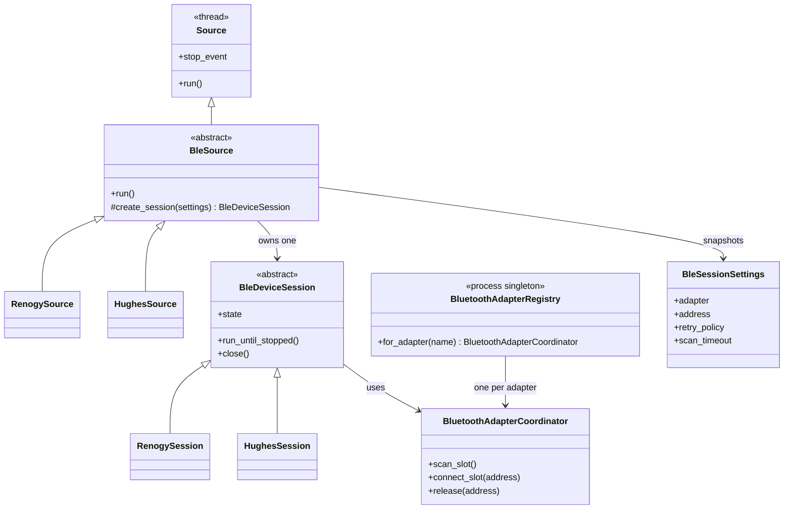
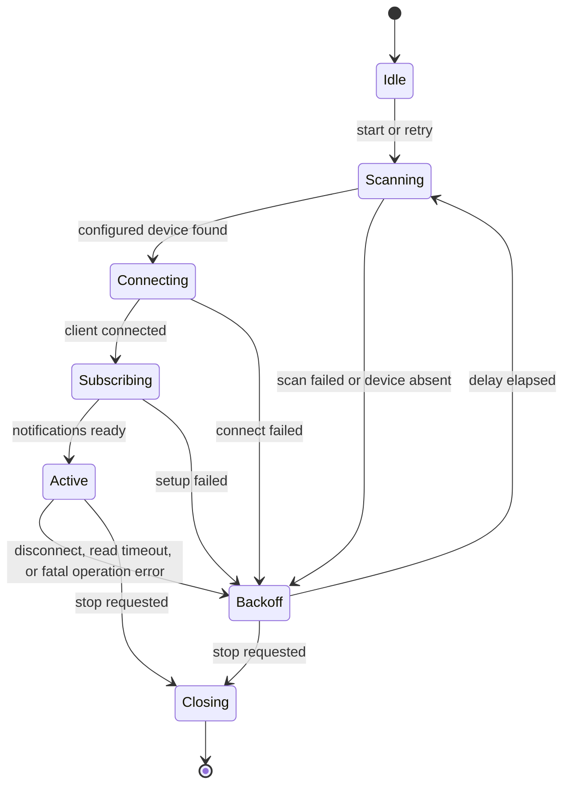

# BLE Connection Reliability Design

## Purpose

Improve the reliability of Renogy and Hughes Bluetooth telemetry without making one failed device block the others. The design gives each configured BLE source its own connection lifecycle while coordinating only the shared BlueZ adapter operations that contend in practice: scanning and establishing connections.

The daemon already runs every configured `Source` in a separate thread. This proposal retains that isolation. It does not introduce one global BLE worker or share a `BleakClient` between devices.

## Observed Weaknesses

- Renogy keeps its `BLEManager` and discovered-device record across retries in persistent mode. A disconnect can therefore retry against stale discovery or characteristic state.
- Renogy has retry behavior in both the client callbacks and the source supervisor. The ownership of a reconnect session is not explicit.
- Several restart-related values were fixed in the client, including discovery and response timeouts and the initial retry delay.
- Independent source threads can still simultaneously ask the same `hci` adapter to scan or establish a connection. BlueZ commonly makes those operations less reliable under contention.
- A retained MQTT payload represents only the most recently retained publication. It cannot demonstrate that both Hughes legs have been received over time.

## Design Goals

- One configured source owns one device connection and can independently rescan and reconnect.
- A reconnect starts a fresh BLE session: fresh scan result, `BleakClient`, services, notification subscription, and write-characteristic handle.
- Scans and connection establishment are coordinated per adapter, but active device sessions remain independent.
- Retry policy is configured per source with service-level defaults.
- Shutdown is prompt, intentional disconnects do not trigger recovery, and no stale client accepts writes.
- One-shot `comms-check` and `interrogate` remain finite operations and do not inherit daemon persistence.

## Object Model



`BluetoothAdapterRegistry` is the singleton boundary. It is a registry keyed by adapter name, not a singleton connection. `for_adapter("hci0")` returns the coordinator for that adapter; `hci1` receives a separate coordinator.

`BluetoothAdapterCoordinator` owns only adapter-wide coordination:

- An async lock around discovery.
- A configurable connection-establishment semaphore, initially one connection at a time.
- Active-address reservations that reject two configured sources using the same device address.
- Optional adapter cooldown after a transport-level BlueZ failure.

It does not retain `BleakClient` objects, protocol decoders, polling timers, or device payloads. Those belong to `BleDeviceSession` and remain isolated to their source.

`BleDeviceSession` is an abstract lifecycle owner. `RenogySession` supplies register polling and write handling; `HughesSession` supplies notification decoding and split-phase aggregation. Both use the same lifecycle state machine but keep protocol logic out of shared transport code.

## Session Lifecycle



Every transition into `Backoff` must first close the current client and discard all session-specific handles. The next `Scanning` state must run a fresh scan; it must not reuse a previous `BLEDevice`, services collection, or characteristic handle. The session resets the retry counter only after it reaches `Active`.

All callbacks should enqueue work onto the session's event loop and check a session generation number. A callback from a closing or superseded client is ignored, preventing it from publishing stale values or scheduling another reconnect.

## Configuration Contract

Service values provide common defaults. A Bluetooth source can override each setting for a device with a different failure profile.

```ini
[service]
reconnect_delay = 10
max_reconnect_delay = 300
max_retry = 0

[renogy_controller]
max_retry = 3
reconnect_delay =
max_reconnect_delay =
discovery_timeout = 5
read_timeout = 15
request_interval = 0.5
write_settle_delay = 0.5
reconnect_jitter = 0.1

[hughes_power_watchdog]
max_retry =
reconnect_delay =
max_reconnect_delay =
notification_timeout = 60
```

Blank source retry fields inherit `[service]`. `max_retry = 0` means retry indefinitely. Delays use capped exponential backoff: $min(base_delay * 2^{attempt - 1}, max_delay)$. Validation must reject negative delays, non-positive timeouts, a maximum delay below the base delay, and malformed Bluetooth addresses.

`request_interval` spaces consecutive Renogy register reads, while `write_settle_delay` controls the brief delay after a request is sent. `reconnect_jitter` randomizes the calculated retry delay by the configured fraction. `notification_timeout` is a Hughes freshness deadline: a connected source that has not decoded a packet before it expires closes its notification session and enters normal reconnect backoff.

## Hughes MQTT Diagnosis

The observed `rv/hughes` payload contains `"line": 2`, not the combined split-phase schema. For a legacy 50A Power Watchdog, `circuit_amps = 50` makes the source wait for one complete line-1 and line-2 packet in the same active session, then publish one payload containing keys such as `voltage_line_1` and `voltage_line_2`.

Therefore, first verify the deployed Hughes source section has `circuit_amps = 50` and that the daemon was restarted after the configuration change. A retained MQTT message can only show the last publication, so repeatedly invoking `mqtt_check --topic rv/hughes` cannot show both historical leg messages. The identical value suggests no newer retained publish has occurred; the source logs should reveal whether it is receiving only line 2 or is no longer connected.

The session implementation should log state changes and counters with the source section and adapter: scan start/result, connect success/failure, notification setup, unexpected disconnect, decoded line number, combined 50A publication, retry attempt, and final retry exhaustion. It should never log credentials.

## Migration Plan

1. Add validated, documented per-source retry and timeout settings with `[service]` fallbacks. Preserve present defaults.
2. Introduce `BluetoothAdapterRegistry` and `BluetoothAdapterCoordinator`, covered by tests for per-adapter locks and duplicate-address reservation.
3. Extract the lifecycle state machine into `BleDeviceSession`; migrate Hughes first because its protocol code is self-contained.
4. Migrate Renogy by recreating its manager and client for every new session, while preserving register-specific clients and guarded MQTT writes.
5. Add structured lifecycle logging and regression tests for scan failure, connect failure, unexpected disconnect, retry exhaustion, clean shutdown during backoff, and two devices sharing one adapter.
6. Verify on hardware with one Renogy device, one Hughes device, and intentional adapter/device interruption. Confirm one source recovering does not pause MQTT publications from the other.

## Acceptance Criteria

- A failed Renogy or Hughes source retries according to its configured policy without stopping other sources.
- Every reconnect performs fresh discovery and creates a fresh client session.
- A source-level override affects only that source; defaults continue to work for existing configurations.
- Simultaneous scan/connect attempts on one adapter are coordinated, while telemetry notifications from already connected devices continue.
- Retained Hughes telemetry for a 50A unit has both line-1 and line-2 fields after complete paired packets are received.
- `comms-check`, `interrogate`, source shutdown, and MQTT write guards retain their current contracts.